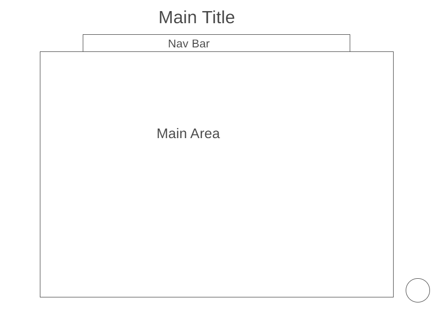

---
# COVID-19 Tracker

The website provide user to see COVID 19 cases, deaths and vaccinated of US states on data visualization chart or map.

-Super Easy to Use

-Simply Fast to Get Result

-Visulization Result

---
## Functionality & MVPs

In The COVID Tracking Project, users will be able to:

- See colorly USA States Map base on Covid-19 Fully Vaccinated and Lenged bar.

- Use Mouse havor each Stae render Tip with Covid-19 cases and deaths data from API.

- Use Mouse havor each Stae render Tip with Covid-19 daily comfirmed line chart from API.

Live site: [COVID-19 Tracker](https://janiceshih.github.io/the-covid-19-tracker/).

---
## Wireframes

---
## Technologies, Libraries, APIs

Libraries: 
D3

API: 
[REST API MongoDB COVID-19 Open Data](https://github.com/M-Media-Group/Covid-19-API)
[CDC Vaccinated Data](https://data.cdc.gov/resource/8xkx-amqh.json)
---
